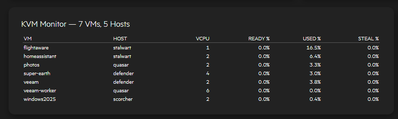
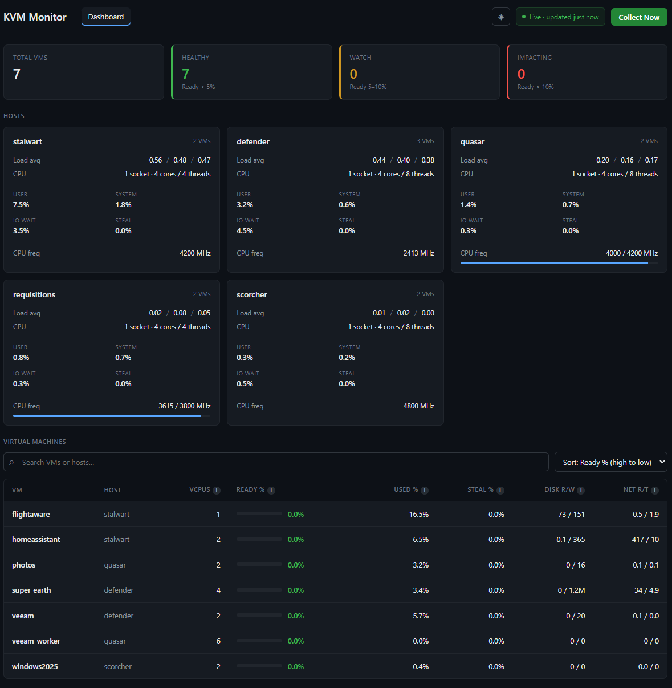
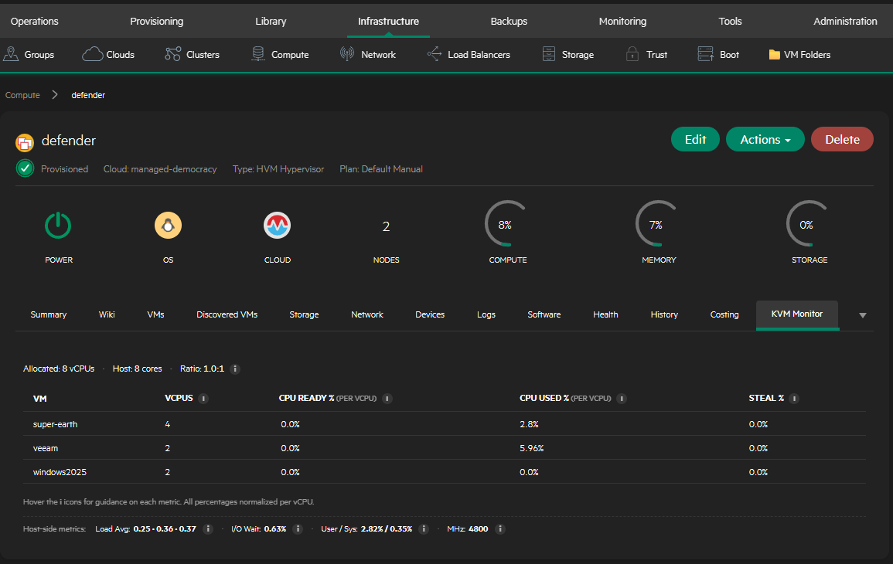
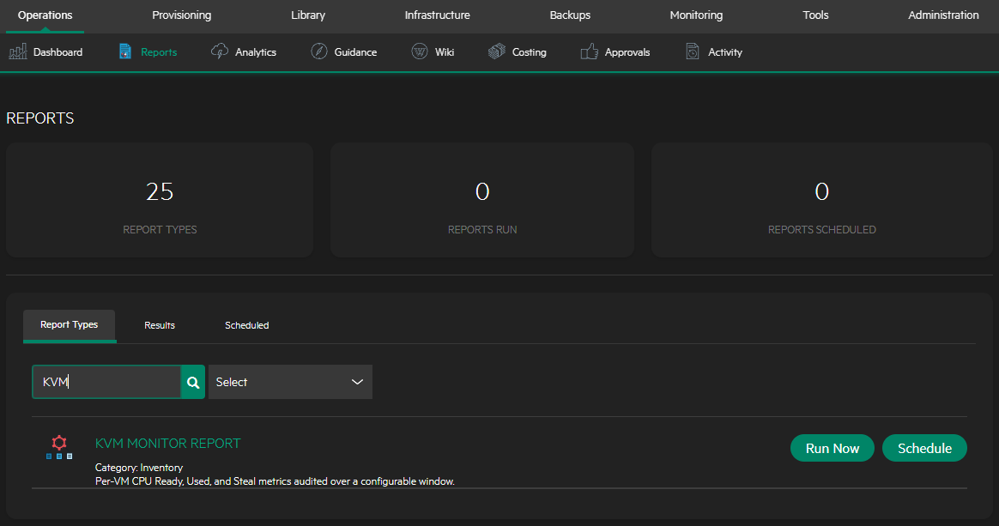
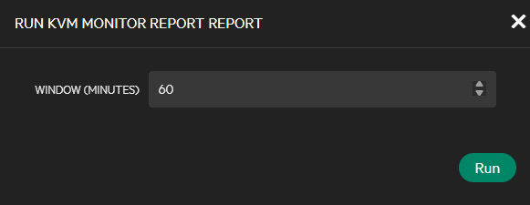
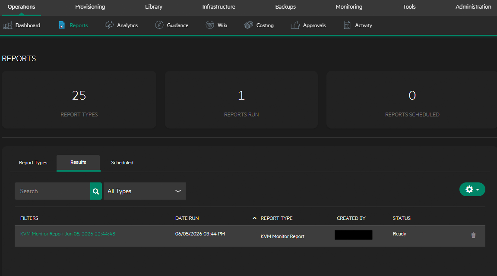
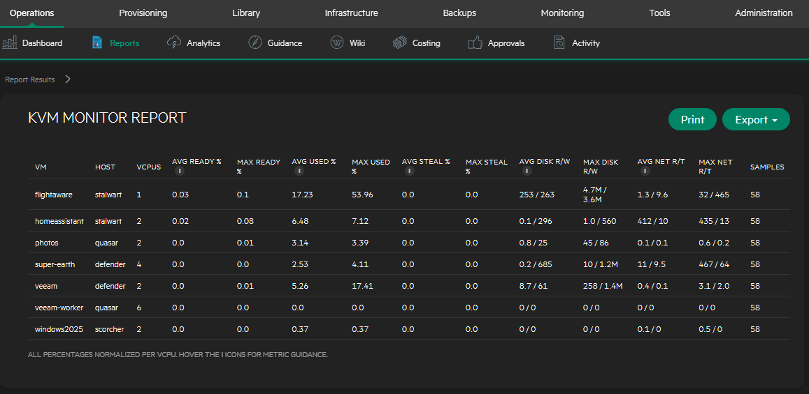
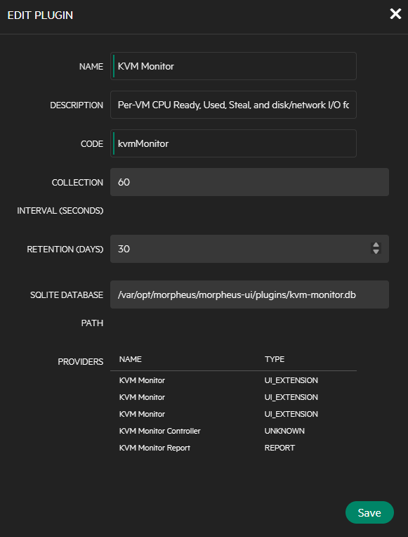

# KVM Monitor for HPE Morpheus / VM Essentials, Enterprise, Community

**CPU Ready and vCPU scheduling metrics for KVM/HVM hypervisors managed by HPE Morpheus (VM Essentials, Enterprise, Community).**

Morpheus doesn't have a native equivalent of VMware's CPU Ready metric. KVM Monitor fills that gap: it collects per-VM vCPU scheduling delay, CPU utilization, steal, and disk/network I/O directly from KVM hosts via `virsh domstats`, stores it locally in SQLite, and surfaces it across three places in the Morpheus UI — a native **dashboard widget**, a per-host **detail tab**, and an Operations **report** with CSV export.

> **License:** Apache 2.0 &nbsp;•&nbsp; **Morpheus:** 8.1.x &nbsp;•&nbsp; **Language:** Groovy (plugin) + JSX (dashboard widget)

## Download

**[⬇ Download the latest release](../../releases/latest)** — grab the `morpheus-kvm-monitor-<version>-all.jar` asset from the latest release (use the `-all` jar).

You don't need to build anything to use the plugin — the precompiled jar attached to each [GitHub Release](../../releases) is ready to upload straight into Morpheus. See [Installation](#installation) below. (Only build from source if you want to modify the plugin — see [Building from source](#building-from-source).)

---

## Screenshots

### Dashboard widget (Operations → Dashboard)


### Standalone dashboard (`/plugin/kvmMonitor/dashboard`)


### Host detail tab (Infrastructure → Hosts → [host] → KVM Monitor)


### Operations report






---

## Features

- **CPU Ready for KVM** — derives a VMware-style "Ready %" from `vcpu.N.delay` (nanoseconds a vCPU was runnable but waiting for physical CPU), computed from deltas between collection cycles.
- **Per-VM metrics** — vCPU count, Ready %, Used %, Steal %, plus disk read/write and network rx/tx I/O.
- **Per-host overview** — load average, CPU breakdown (user / system / iowait / steal), and MHz utilization ratio.
- **Three display surfaces:**
  - **Dashboard widget** — native React widget on the Operations dashboard grid, selectable under Administration → Settings → Dashboards to Display. The widget title links to the full standalone dashboard.
  - **Host detail tab** — KVM scheduling metrics inline on each KVM host's detail page.
  - **Operations report** — historical CPU Ready report with CSV export.
- **Standalone dashboard** — a full single-page view at `/plugin/kvmMonitor/dashboard` with host cards, the VM table, light/dark theme (OS preference detection + persistence), and a "Collect Now" button.
- **Background collection** — a collector thread samples every 60s (configurable) and retains history for 30 days (configurable).
- **Self-contained storage** — metrics persist in SQLite (`kvm-monitor.db`), independent of any Morpheus OpenSearch/Elasticsearch backend, so it survives storage-backend migrations.
- **Deep-dive tooltips** — every metric in the UI has an info bubble explaining what it means and the threshold guidance for it.

---

## Installation

1. Download the latest `morpheus-kvm-monitor-<version>-all.jar` from [Releases](../../releases).
2. In Morpheus: **Administration → Integrations → Plugins → Add**, and upload the jar.
3. The plugin registers automatically. To show the dashboard widget, go to **Administration → Settings → Dashboards to Display**, search **KVM Monitor**, add it, and save.
4. (Optional) Open **Administration → Integrations → Plugins → KVM Monitor (edit)** to set the collection interval, retention, and SQLite path.

> **Requirements:** Morpheus 8.1.x, KVM/VM Essentials hosts reachable by the appliance, and `virsh` available on those hosts (the collector uses `virsh list` + `virsh domstats --vcpu`).

---

## Configuration

Settings are available on the plugin's edit dialog:



| Setting | Default | Meaning |
|---|---|---|
| Collection Interval (seconds) | 60 | How often the collector samples each KVM host. |
| Retention (days) | 30 | How long samples are kept in SQLite before pruning. |
| SQLite Database Path | `/var/opt/morpheus/morpheus-ui/plugins/kvm-monitor.db` | Where metric history is stored. |

---

## Metrics reference

See [docs/METRICS.md](docs/METRICS.md) for the full explanation of every metric, how it is derived from `virsh domstats`, and the threshold guidance used in the UI tooltips. Quick summary:

| Metric | Source | Meaning | Watch when |
|---|---|---|---|
| **Ready %** | `vcpu.N.delay` deltas | % of time vCPUs were runnable but waiting on physical CPU (CPU Ready analog) | > 5% = contention, > 10% = impacting |
| **Used %** | `vcpu.N.time` deltas | % of allocated vCPU actually consumed | sustained near 100% |
| **Steal %** | host steal counters | % of time host CPU was stolen by overcommit/other tenants | > 0% under load |
| **Disk R/W** | `block.N.rd/wr.bytes` deltas | per-VM disk throughput | — |
| **Net R/T** | `net.N.rx/tx.bytes` deltas | per-VM network throughput | — |

---

## Building from source

This project ships its own Gradle wrapper, pinned to a known-good Gradle version. **Always build with the wrapper**, not a system Gradle. See [BUILD.md](BUILD.md) for full details (Linux, Windows, and Docker). Quick version:

```bash
chmod +x ./gradlew
./gradlew clean shadowJar
# output: build/libs/morpheus-kvm-monitor-<version>-all.jar  (use the -all jar)
```

---

## Architecture

| Component | Role |
|---|---|
| `KvmMonitorPlugin` | Entry point; registers all providers, starts the collector. |
| `KvmCollectorService` | Background thread; runs `virsh` over each host, parses `domstats`, writes samples. |
| `KvmMetricStore` | SQLite persistence + delta/rate computation. |
| `KvmMonitorController` | Serves the standalone dashboard SPA and the `/api/*` JSON endpoints. |
| `KvmServerTabProvider` | Native host-detail tab. |
| `KvmReportProvider` | Operations report with CSV export. |
| `KvmMonitorDashboardProvider` / `KvmMonitorDashboardItemProvider` | Native dashboard + React widget (compiled from `kvm-monitor-widget.jsx`). |

---

## License

Apache License 2.0. See [LICENSE](LICENSE).
